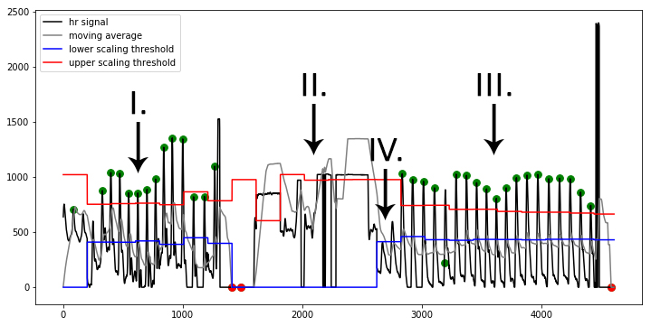
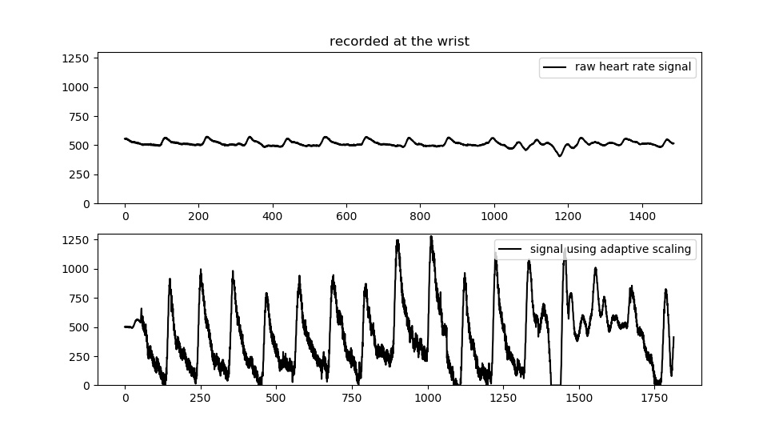

.. _algorithm functioning:

**********************************
Background - Algorithm functioning
**********************************

This section describes the details of the algorithm functionality. 

Pre-processing
==============
Depending on which implementation you select, several pre-processing steps can be applied.

Adaptive Input Amplitude Scaling
~~~~~~~~~~~~~~~~~~~~~~~~~~~~~~~~
This feature is available on all implementations. It can be turned on by setting the flag "adaptivescale" in the "user settable variables" section to 0. The 8-bit AVR boards (Arduino) will be restricted in sampling rate when using adaptive scaling, since it relies on 16- and 32-bit computations, which run slower on 8-bit systems. The ARM (Teensy, 32-bit) boards can handle high sampling rates without issue.

The adaptive scaling funcions in periods of 2 seconds. At the end of each 2-second period the signal minimum and maximum are determined over the preceding period. The signal in the next period is scaled using these values. This accomodates changes in signal amplitude. 

In the PPG signal, amplitude is influenced mostly by the position where the signal is measured: areas with less capillaries show less perfusion-discoloration and thus produce a weaker signal. Area's like the fingertip and earlobe show strong signals, especially in younger to middle-aged individuals with no history of heavy smoking. Furthermore, low-frequency amplitude changes occur over time due to changes in for example blood pressure, or vasoconstriction in response to (internal or external) stressors. Adaptive scaling also accomodates instances where reduced blood perfusion leads to a lower signal amplitude baseline, such as in the elderly or long-term smokers.

While not as powerful as the adaptive moving average used in the other implementations, the adaptive signal scaling is still quite powerful as shown on the figure below:

*Image showing result of the real-time AVR implementation in different conditions. In the first part (I.), the signal is measured at the fingertip. A period of sensor disconnect occurs (II.) while moving the sensor to a new measurement location. In the final segment (III.) the signal is measured on the cheek, where signal amplitude is much weaker. The adaptive scaling kicks in after the first two low-amplitude beats (IV.) to stabilize amplitude and allow further analysis.*

The following image shows a signal recorded at the top of the wrist, a location where typically PPG sensors record a very low amplitude signal. Two recordings are displayed below, one made without adaptive scaling (top) and one with (bottom).

As you can see it makes quite a difference. Keep in mind that it is not a magic bullet: noise will scale as well, meaning that the lower the amplitude of the original signal, generally the more noise you'll find in the scaled recording.

Peak detection & Error Detection
================================
Two types of peak detection are available, one real-time using adaptive scaling, and one using an adaptive threshold similar to the Python implementation. The latter one is only available on ARM (Teensy) boards due to RAM demands made by the required buffers.

Adaptive Scaling
~~~~~~~~~~~~~~~~
When comparing the AVR implementations to the full ARM or Python implementations, the first thing to note is that there is not adaptive moving average in the AVR version. The main reason is that AVR chips have very limited RAM, so the use of buffers required for the adaptive moving average is not feasible. In stead, the AVR implmentation implements adaptive signal scaling as discussed above. 

In the case of adaptive scaling, peak detection functions with a fixed moving average that is computed on-the-fly for each datapoint read from the sensor. Whenever the signal exceeds the moving average, it is stored in a "region of interest" buffer until it dips below the moving average again. The peak is then identified in the region of interest and marked. This process is similar to the adaptive threshold used in the `Python version <https://python-heart-rate-analysis-toolkit.readthedocs.io/en/latest/algorithmfunctioning.html#peak-detection>`_, but in stead of moving the threshold (which requires too much RAM to buffer the signal first), it attempts to standardise the amplitude over time. 

Adaptive Threshold
~~~~~~~~~~~~~~~~~~
The adaptive threshold is similar to what is discussed in the `Python version documentation. <https://python-heart-rate-analysis-toolkit.readthedocs.io/en/latest/algorithmfunctioning.html#peak-detection>`_ Limitations in the available RAM mean that sampling rate and size of the total segment of the analysed signal are more limited however. The adaptive thresholding implementation is only available on the Teensy 3.1, 3.2, 3.5 and 3.6. The 3.5 and 3.6 have enough RAM (128k, 256k) to allow for faster sampling speeds than the 3.1 and 3.2 (64k).

It functions as described in the Python documentation. `Click here to go to the page. <https://python-heart-rate-analysis-toolkit.readthedocs.io/en/latest/algorithmfunctioning.html#peak-detection>`_

.. image:: images/fitresultsimg.jpg

Error Detection
~~~~~~~~~~~~~~~
Error-detection functions in three stages:

1. The RR-interval with the previously marked peak is computed and evaluated whether it falls into to the expected BPM range (settable under "user settable variables").
2. The RR-interval is compared to the previous RR-interval. It is not allowed to deviate more than 350ms, otherwise it is ignored.
3. Thresholds are computed based on the mean of the last 20 RR-intervals. Thresholds are determined as **RR_mean +/- (30% of RR_mean, with minimum value of 300)** (+ or - for upper and lower threshold, respectively). If the RR-interval exceeds one of the thresholds, it is ignored. This is the same as the `thresholding used in the Python version <https://python-heart-rate-analysis-toolkit.readthedocs.io/en/latest/algorithmfunctioning.html#peak-rejection>`_

Calculation of Measures
=======================
All measures are computed on the detected and accepted peaks in the segment. When RR-intervals are used in computation, only the intervals created by two adjacent, accepted, peaks are used. Whenever differences in RR-intervals are required (for example in the RMSSD), only intervals between two adjacens RR-intervals, which in turn are created by three adjacent, accepted, peaks are used. This ensures that any rejected peaks do not inject measurement error in the subsequent measure calculations.

Time-series
~~~~~~~~~~~
Time series measurements are computed from detected peaks. The output measures are:

- beats per minute (BPM)
- interbeat interval (IBI)
- standard deviation of RR intervals (SDNN)
- standard deviation of successive differences (SDSD)
- root mean square of successive differences (RMSSD)
- proportion of successive differences above 20ms (pNN20)
- proportion of successive differences above 50ms (pNN50)
- median absolute deviation of RR intervals (MAD)

Frequency Domain
~~~~~~~~~~~~~~~~
Frequency domain measures computed are:

- low-frequency, frequency spectrum between 0.05-0.15Hz (LF)
- high-frequency, frequency spectrum between 0.15-0.5Hz (HF)
- the ration high frequency / low frequency (HF/LF)

The measures are computed from the PSD (Power Spectral Density), which itself is estimated using either FFT-based, Periodogram-based, or Welch-based methods. The default is Welch's method.

