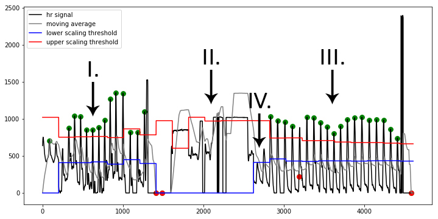

Welcome to Arduino Heart Rate Analysis Toolkit's Documentation!
===============================================================

Welcome to the Arduino Heart Rate Analysis Toolkit's documentation. This documentation describes the embedded implementations available for heart rate analysis. 

The toolkit was presented at the Humanist 2018 conference in The Hague (`see paper here <https://www.researchgate.net/publication/325967542_Heart_Rate_Analysis_for_Human_Factors_Development_and_Validation_of_an_Open_Source_Toolkit_for_Noisy_Naturalistic_Heart_Rate_Data>`_ ). A technical paper about the functionality is currently under review and will be linked here as soon as it's published.

**Please cite one or both of these papers when using the toolkit in your research!**

The documentation will help you get up to speed quickly. Follow the :ref:`quickstart` guide for a general overview of how to use the toolkit in only a few lines of code. For a more in-depth review of the module's functionality you can refer to the papers mentioned above, or the :ref:`heart rate analysis` overview.

Note on using it in scientific research
~~~~~~~~~~~~~~~~~~~~~~~~~~~~~~~~~~~~~~~
Support is available at P.vanGent@tudelft.nl. When using the toolkit in your scientific work: please include me in the process. I can help you implement the toolkit, and the collaboration will also help improve the toolkit so that it can handle more types of data in the future.

Index
======
.. toctree::
   :maxdepth: 3
   :caption: .

   quickstart
   implementations
   hookupguide
   heartrateanalysis
   algorithmfunctioning
   development