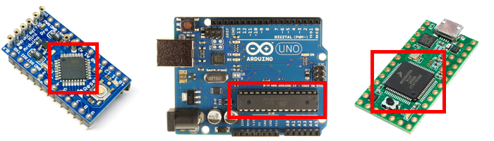

.. _quickstart:

****************
Quickstart Guide
****************

If you find yourself here, chances are you want to use the developed toolkit in your research or some other open-source application. Great! On this page we will describe the options available to you. If you already know what you want please go to the :ref:`implementations` section.

Otherwise, look at the statements below and click whichever one is closest to your situation:

Where to begin?
===============

- `I have recorded heart rate data and want to analyse it`_
- `I have a way of recording heart rate data, and just want to analyse the recorded data`_
- `I just want to record heart rate data unintrusively, I have my own analysis tools`_
- `I want to record heart rate data unintrusively, it's ok if the analysis is done later (offline)`_
- `I want to record heart rate data and analyse the results real-time`_

|

I have recorded heart rate data and want to analyse it
~~~~~~~~~~~~~~~~~~~~~~~~~~~~~~~~~~~~~~~~~~~~~~~~~~~~~~
You need the Python implementation of this toolkit. Take a look at the repository here: https://github.com/paulvangentcom/heartrate_analysis_python

And at the documentation here: https://python-heart-rate-analysis-toolkit.readthedocs.io/en/latest/

|

I have a way of recording heart rate data, and just want to analyse the recorded data
~~~~~~~~~~~~~~~~~~~~~~~~~~~~~~~~~~~~~~~~~~~~~~~~~~~~~~~~~~~~~~~~~~~~~~~~~~~~~~~~~~~~~
Our Python version of the toolkit handles pre-recorded data (and is most complete in functionality). However, often open source alternatives might be a better alternative to record your heart rate data. They are completely transparent, adjustable to your needs and free of charge.

For the Python version if you just want to analyse, take a look at the repository here: https://github.com/paulvangentcom/heartrate_analysis_python

And at the documentation here: https://python-heart-rate-analysis-toolkit.readthedocs.io/en/latest/

We recommend you take a look at the :ref:`implementations` section to familiarise yourself with what's possible. It only takes around $20,- to get started!

|

I just want to record heart rate data unintrusively, I have my own analysis tools
~~~~~~~~~~~~~~~~~~~~~~~~~~~~~~~~~~~~~~~~~~~~~~~~~~~~~~~~~~~~~~~~~~~~~~~~~~~~~~~~~
The :ref:`simplelogger` implementation is just what you need! It reliably logs data either over USB or to an SD memory card. Feel free to contact me if you need help implementing this: P.vanGent@tudelft.nl

|

I want to record heart rate data unintrusively, it's ok if the analysis is done later (offline)
~~~~~~~~~~~~~~~~~~~~~~~~~~~~~~~~~~~~~~~~~~~~~~~~~~~~~~~~~~~~~~~~~~~~~~~~~~~~~~~~~~~~~~~~~~~~~~~
The :ref:`simplelogger` implementation is just what you need! It reliably logs data either over USB or to an SD memory card.

To analyse the results, we suggest you take a look at our Python analysis toolkit: https://github.com/paulvangentcom/heartrate_analysis_python

|

I want to record heart rate data and analyse the results real-time
~~~~~~~~~~~~~~~~~~~~~~~~~~~~~~~~~~~~~~~~~~~~~~~~~~~~~~~~~~~~~~~~~~~
Your options here depend on what exactly you want. 

Do you have on-line analysis tools on your PC and just want to stream sensor data? Look at the :ref:`simplelogger` USB implementation.

A second option is the peak finder, which detects and returns detected peaks and RR-intervals realtime: :ref:`peakfinder`.

The time series analysis version is based on the peak finder, and outputs time-series measurements real-time: :ref:`timeseriesanalysis`

Finally, the full implementation is almost identical to the Python implementation. It is the most noise-robust and reliable. It only runs on Teensy ARM board due to the amount of RAM required for buffering and analysis: :ref:`fullanalysis`.

|

------------------

What board do I have?
=====================

*"8-bit AVR, 32-bit ARM, what? I just bought this board. Can it run the toolkits you made?"* I understand, it can be confusing. If you're unsure what you have please find a few methods of getting your board type in this section.

**Method 1: Is it mentioned in this table?**

Check the table below to see if you recognize the name of the board. You can also look up what CPU your board has and see if that is in the table.

+------------------------+----------------+-----------------+---------------+---------------------------+
| Board type             | CPU            | Instruction set | RAM available | Available implementations |
+========================+================+=================+===============+===========================+
| | Arduino Gemma,       | ATTiny45/85    | 8-bit           | 512 byte      | | :ref:`simplelogger`     |
| | Adafruit Trinket,    |                |                 |               | | USB version only!       | 
| | Digispark USB        |                |                 |               |                           |
+------------------------+----------------+-----------------+---------------+---------------------------+
| | Arduino Uno, Lilypad,| Atmega 328p    | 8-bit           | 2 KiloByte    | | :ref:`simplelogger`     |
| | Lilypad Simplesnap,  |                |                 |               | | :ref:`peakfinder`       |
| | Pro 16MHz, Pro mini, |                |                 |               | | up to XX Hz             |
| | Ethernet, Mini, Nano,|                |                 |               |                           |
| | BT, Fio              |                |                 |               |                           |
+------------------------+----------------+-----------------+---------------+---------------------------+
| | Arduino Lilypad USB, | Atmega 32U4    | 8-bit           | 2.5 KiloByte  | | :ref:`simplelogger`     |
| | Micro, Espiora,      |                |                 |               | | :ref:`peakfinder`       |
| | Leonardo, Yún, Robot |                |                 |               | | up to XX Hz             |
| | Teensy 2.0           |                |                 |               |                           |
+------------------------+----------------+-----------------+---------------+---------------------------+
| Arduino Mega, Mega ADK | Atmega 2560    | 8-bit           | 8 KiloByte    | | :ref:`simplelogger`     |                            
|                        |                |                 |               | | :ref:`peakfinder`       |
|                        |                |                 |               | | up to XX Hz             |
+------------------------+----------------+-----------------+---------------+---------------------------+
| | Teensy LC,           | ARM Cortex M0+ | 32-bit          | 32 kiloByte   | | :ref:`simplelogger`     |
| | Arduino MKR Zero     |                |                 |               | | :ref:`peakfinder`       |
| | Adafruit Itsybitsy,  |                |                 |               | | :ref:`fullanalysis`     |
| | Feather M0           |                |                 |               |                           |
+------------------------+----------------+-----------------+---------------+---------------------------+
| | Teensy 3.1, 3.2,     | ARM Cortex M4  | 32-bit          | | 64 - 256    | | :ref:`simplelogger`     |
| | 3.5, 3.6             |                |                 | | KiloByte    | | :ref:`peakfinder`       |
| | Adafruit Feather M4  |                |                 |               | | :ref:`fullanalysis`     |
|                        |                |                 |               | | up to XX Hz             |
+------------------------+----------------+-----------------+---------------+---------------------------+

|

**Method 2: Look at the processor**

Look to see if you can find any information on there. Usually if it says "Atmel" it will be an 8-bit RISC and you will find the type in the table above. If it says "ARM" or "Cortex", you can also find the chip in the table above. If you find markings like this: 

That likely means you have an ARM Cortex chip on the board.

If this doesn't help, you can google the number printed on the chip and see what comes up.

|

**Method 4: Talk to me**
Contact me at P.vanGent@tudelft.nl and show me a picture of the board and/or its name.

|

