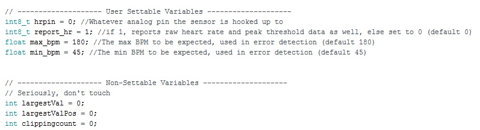

.. _quickstart:

****************
Quickstart Guide
****************

Where to begin?
===============
If you find yourself here, chances are you want to use the developed toolkit in your research or some other non-commercial application.

Coding Structure
================

Each Arduino implementation has a similar coding structure to help you get started as quickly as possible. Typically at the top of the file you'll find the license and reference to cite if you use the code in your scientific project. Below this you'll find the user settable variables. These are discussed on the page corresponding to the implementation. The link is provided in the file as well as here on the documentation. It will look something like this:

Important is that you only change the variables in the  **"User Settable Variables"** section. Changing any of the other variables will likely lead to compilation errors or unexpected behaviours. Comments in the code will explain what each settable variable does, and this documentation will provide further reference.

Basic Example
=============
